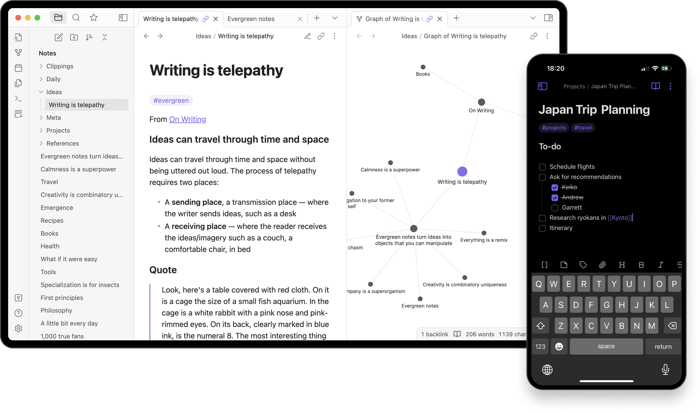

# 
 Obsidian

**Obsidian** is a [personal knowledge base](https://en.wikipedia.org/wiki/Personal_knowledge_base "Personal knowledge base") and [note-taking](https://en.wikipedia.org/wiki/Note-taking "Note-taking") application that operates on [markdown](https://en.wikipedia.org/wiki/Markdown "Markdown") files.[\[1\]](https://en.wikipedia.org/wiki/Obsidian_%28software%29#cite_note-Eastman-3)[\[2\]](https://en.wikipedia.org/wiki/Obsidian_%28software%29#cite_note-Myrick-4)[\[3\]](https://en.wikipedia.org/wiki/Obsidian_%28software%29#cite_note-5)

    

 
 

Also available on Linux  
    
  

Amongst others here are the main features Obsidian offers:

* Support for all current platforms and browsers
* Mobile applications
* Web and native SDKs for integration
* Content sharing

And many more!

## Documentation

All the Obsidian documentation is available in [the handbook](https://help.obsidian.md/).

## Security
With Obsidian Sync, your data is secured using the strongest encryption standard, AES‑256.  

For a detailed description of Obsidian's End-to-End Encryption (E2EE) implementation,
please check [this link](https://obsidian.md/security).

## Contributing

If you are looking to contribute to Obsidian, first of all, thank you! Please
see our [guidelines for contributing](https://publish.obsidian.md/hub/CONTRIBUTING).

 
 

<footer>

Built with ❤️ from 🇨🇳 & 🇸🇦 
 Credits: <a href="https://8x8.com" target="_blank">8x8</a> and our community

</footer>
